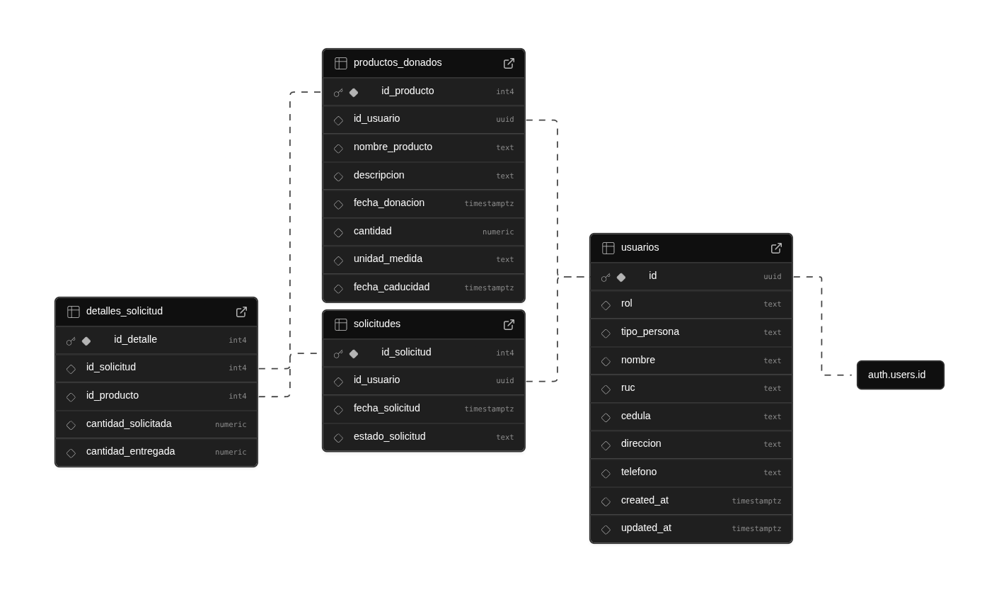

# 🍲 Banco de Alimentos ULEAM

## 📋 Descripción del Proyecto

Sistema web integral para la gestión de un banco de alimentos que conecta a donantes, beneficiarios y administradores en una plataforma unificada. El proyecto facilita la distribución eficiente de alimentos y el seguimiento completo del inventario con trazabilidad total de movimientos.

## ✨ Características Principales

### 🔐 **Sistema de Autenticación y Perfiles**
- Registro y autenticación de usuarios con **Supabase Auth**
- Verificación de email automática
- **Validación de identidad** con APIs oficiales de Ecuador (RUC y cédula)
- **Perfiles diferenciados** por tipo de usuario (Natural/Jurídico)
- **Completado progresivo** de perfiles con rutas públicas accesibles

### 👥 **Gestión de Usuarios Multi-Rol**
- **Donantes**: Personas naturales o jurídicas que donan alimentos
- **Beneficiarios**: Usuarios que solicitan alimentos
- **Administradores**: Gestión completa del sistema e inventario

### 🎁 **Sistema de Donaciones**
- **Catálogo de alimentos** predefinido con categorías
- **Productos personalizados** para alimentos no catalogados
- **Cálculo automático de impacto** (personas alimentadas)
- **Estados de donación**: Pendiente → Recogida → Entregada → Cancelada
- **Integración automática** con el inventario al marcar como entregada

### 📋 **Gestión de Solicitudes**
- **Formulario de solicitudes** de alimentos por beneficiarios
- **Aprobación administrativa** con descuento automático de inventario
- **Estados de solicitud**: Pendiente → Aprobada → Entregada
- **Verificación de disponibilidad** en tiempo real

### 📊 **Sistema de Inventario Avanzado**
- **Gestión de depósitos** múltiples
- **Control de stock** en tiempo real
- **Fechas de vencimiento** y alertas automáticas
- **Ajustes manuales** con registro automático de movimientos
- **Reportes de inventario** con filtros avanzados

### 📈 **Trazabilidad y Movimientos**
- **Registro automático** de todos los movimientos de inventario
- **Tipos de transacción**: Ingreso, Egreso, Baja
- **Trazabilidad completa**: Usuario responsable, fecha/hora, observaciones
- **Reportes de movimientos** con sistema de prioridades
- **Prevención de duplicados** en reportes


## 🛠️ Tecnologías Utilizadas

### **Framework y Runtime**
- **Next.js 15.3.4** con App Router
  - Server-Side Rendering (SSR)
  - Static Site Generation (SSG)
  - API Routes integradas
  - Turbopack para desarrollo optimizado

### **Frontend**
- **React 19.0.0** con Hooks modernos
- **TypeScript 5** con tipado estricto
- **Tailwind CSS 4** para estilos responsivos
- **Lucide React** para iconografía
- **Heroicons** para iconos adicionales

### **Backend y Base de Datos**
- **Supabase** como Backend-as-a-Service
  - PostgreSQL como base de datos
  - Autenticación integrada con verificación de email
  - Row Level Security (RLS)
  - API REST automática
  - Manejo de archivos y storage

### **Mapas y Geolocalización**
- **Mapbox GL** para mapas interactivos
- Integración con geolocalización

### **Herramientas de Desarrollo**
- **ESLint 9** con configuración Next.js
- **PostCSS** para procesamiento CSS
- **ts-node** para ejecución de TypeScript

## 📧 Configuración de Correos

El sistema envía notificaciones por email mediante un proveedor abstraído. Por defecto se incluye **Gmail** utilizando SMTP seguro y puedes migrar a otro servicio creando un proveedor que implemente la misma interfaz.

### Variables de entorno
- `EMAIL_PROVIDER=gmail` – Proveedor activo (por ahora sólo `gmail`).
- `EMAIL_GMAIL_USER` – Cuenta de Gmail o alias habilitado para SMTP.
- `EMAIL_GMAIL_PASS` – Contraseña de aplicación generada en la cuenta de Gmail.
- `EMAIL_FROM_ADDRESS` *(opcional)* – Remitente usado en los correos. Por defecto se usa la cuenta de Gmail.
- `EMAIL_FROM_NAME` *(opcional)* – Nombre descriptivo del remitente.
- `EMAIL_SUPPRESS_SEND` *(opcional)* – Si es `true`, los correos se registran en consola pero no se envían (útil en desarrollo).
- `EMAIL_LOG_ONLY` *(opcional)* – Si es `true`, se mantiene el envío y se deja constancia en consola.
- `SUPABASE_SERVICE_ROLE_KEY` – Clave de servicio usada en el backend para saltar RLS al crear notificaciones (nunca exponer en el cliente).

> Para Gmail debes habilitar la verificación en dos pasos y crear una **contraseña de aplicación** dedicada. No se recomienda usar la contraseña principal de la cuenta.

### Cambiar de proveedor

1. Crea una clase que implemente `EmailProvider` en `src/lib/email/providers/`.
2. Define la lógica de inicialización usando tus credenciales (por ejemplo SES, SendGrid, Resend).
3. Amplía `loadEmailConfig` para cargar las variables del nuevo proveedor.
4. Actualiza el factory en `emailService` para instanciar tu nueva clase cuando `EMAIL_PROVIDER` coincida.

Todo el código de negocio (servicios y API) consume el servicio de correo agnóstico, por lo que no es necesario modificar los casos de uso al migrar.

## 📁 Arquitectura del Proyecto

```
banco-alimentos/
├── src/
│   ├── app/                          # App Router de Next.js 15
│   │   ├── api/                      # API Routes
│   │   │   └── consultar-identificacion/  # Validación RUC/Cédula
│   │   ├── auth/                     # Sistema de autenticación
│   │   │   ├── iniciar-sesion/       # Login con validación de perfil
│   │   │   ├── registrar/            # Registro simplificado
│   │   │   ├── olvide-contrasena/    # Recuperación de contraseña
│   │   │   ├── restablecer-contrasena/
│   │   │   └── verificar-email/      # Verificación automática
│   │   ├── admin/                    # Panel administrativo
│   │   │   ├── dashboard/            # Estadísticas y análisis
│   │   │   ├── catalogo/             # Gestión de productos
│   │   │   ├── usuarios/             # Administración de usuarios
│   │   │   ├── configuracion/        # Configuración del sistema
│   │   │   └── reportes/             # Sistema de reportes
│   │   │       ├── donaciones/       # Gestión y seguimiento
│   │   │       ├── solicitudes/      # Aprobación y control
│   │   │       ├── inventario/       # Control de stock
│   │   │       ├── movimientos/      # Trazabilidad completa
│   │   │       └── historial/        # Histórico de operaciones
│   │   ├── donante/                  # Panel para donantes
│   │   │   ├── dashboard/            # Resumen de donaciones
│   │   │   ├── nueva-donacion/       # Formulario de donación
│   │   │   ├── donaciones/           # Historial personal
│   │   │   ├── solicitudes/          # Ver solicitudes activas
│   │   │   └── perfil/               # Gestión de perfil
│   │   ├── user/                     # Panel para beneficiarios
│   │   │   ├── dashboard/            # Resumen personal
│   │   │   ├── formulario/           # Solicitar alimentos
│   │   │   ├── solicitudes/          # Seguimiento de solicitudes
│   │   │   ├── configuracion/        # Preferencias
│   │   │   └── perfil/               # Gestión de perfil
│   │   ├── perfil/                   # Gestión de perfiles
│   │   │   ├── completar/            # Completado obligatorio
│   │   │   └── actualizar/           # Actualización de datos
│   │   ├── components/               # Componentes reutilizables
│   │   │   ├── DashboardLayout.tsx   # Layout principal
│   │   │   ├── Sidebar.tsx           # Navegación lateral
│   │   │   ├── MapboxMap.tsx         # Componente de mapas
│   │   │   ├── NotificacionesDropdown.tsx
│   │   │   ├── SupabaseProvider.tsx  # Proveedor de contexto
│   │   │   └── ui/                   # Componentes UI
│   │   └── globals.css               # Estilos globales y sistema de diseño
│   ├── lib/                          # Utilidades y configuraciones
│   │   ├── supabase.ts               # Cliente Supabase
│   │   ├── supabase-server.ts        # Cliente server-side
│   │   ├── constantes.ts             # Constantes de la aplicación
│   │   └── validaciones.ts           # Esquemas de validación
│   ├── hooks/                        # Hooks personalizados
│   │   └── useNotificaciones.ts      # Gestión de notificaciones
│   └── middleware.ts                 # Middleware de autenticación
├── public/                           # Archivos estáticos
├── docs/                             # Documentación del proyecto
│   ├── REGISTRO_MOVIMIENTOS.md       # Sistema de trazabilidad
│   ├── VERIFICACION_INVENTARIO.md    # Control de inventario
│   └── GLOBAL-CSS-DOCUMENTATION.md   # Sistema de diseño
└── configuraciones/                  # Archivos de configuración
    ├── package.json                  # Dependencias del proyecto
    ├── tailwind.config.ts            # Configuración de Tailwind
    ├── next.config.ts                # Configuración de Next.js
    ├── tsconfig.json                 # Configuración de TypeScript
    └── eslint.config.mjs             # Configuración de ESLint
```

## 🗄️ Esquema de Base de Datos



### **Tablas Principales**

#### **usuarios**
- Gestión de perfiles de usuario con validación de RUC/cédula
- Soporte para personas naturales y jurídicas
- Estados de cuenta y roles diferenciados

#### **donaciones**
- Registro completo de donaciones con impacto calculado
- Estados: Pendiente → Recogida → Entregada → Cancelada
- Integración automática con inventario

#### **solicitudes**
- Solicitudes de alimentos por beneficiarios
- Aprobación administrativa con descuento automático
- Trazabilidad completa del proceso

#### **inventario**
- Gestión de múltiples depósitos
- Fechas de vencimiento y alertas

#### **movimiento_inventario_cabecera** y **movimiento_inventario_detalle**
- Sistema de trazabilidad completa
- Registro automático de todos los movimientos
- Relación con donantes, solicitantes y productos

## 🔄 Sistema de Inventario y Movimientos

### **Registro Automático de Movimientos**
El sistema registra automáticamente todos los movimientos en las tablas especializadas:

- ✅ **Aprobación de Solicitudes**: Registra egresos cuando se aprueban solicitudes
- ✅ **Entrega de Donaciones**: Registra ingresos cuando se marcan como entregadas
- ✅ **Ajustes Manuales**: Los administradores pueden ajustar cantidades con registro automático

### **Trazabilidad Completa**
- 📅 **Fecha/hora exacta** de cada movimiento
- 👤 **Usuario responsable** de la operación
- 📝 **Observaciones detalladas** de cada transacción
- 🏷️ **Tipos de transacción**: 'ingreso', 'egreso', 'baja'
- 👥 **Roles**: 'donante', 'beneficiario', 'distribuidor'
- ⚡ **Estados**: 'pendiente', 'completado', 'donado'

### **Reportes Avanzados**
- 🎯 **Sistema de prioridades**: Movimientos registrados → Donaciones → Solicitudes
- 🚫 **Prevención de duplicados** en reportes
- 🔍 **Logs detallados** para debugging y auditoría

## 🚀 Funcionalidades Destacadas

### **🔐 Validación de Identidad**
- Integración con **APIs oficiales de Ecuador** para validación de RUC y cédula
- Verificación automática de **fecha de emisión de cédula**
- Autocompletado de datos desde servicios gubernamentales

### **📱 Interfaz Responsiva**
- Diseño **mobile-first** con Tailwind CSS
- **Sistema de diseño** consistente documentado
- **Componentes reutilizables** y modulares

### **🎯 Cálculo de Impacto**
- **Estimación automática** de personas alimentadas
- **Equivalencias de comida** basadas en cantidad y tipo
- **Métricas de impacto social** en tiempo real

### **🔔 Sistema de Notificaciones**
- Notificaciones en tiempo real
- Alertas de vencimiento de productos
- Estado de solicitudes y donaciones

### **🌍 Geolocalización**
- Integración con **Mapbox** para ubicaciones
- Visualización de **puntos de entrega**
- **Rutas optimizadas** para recolección

## 📊 Flujos de Trabajo

### **Para Donantes**
1. **Registro** → Verificación de email
2. **Completar perfil** → Validación automática de identidad
3. **Nueva donación** → Selección de productos y cantidades
4. **Seguimiento** → Estados de la donación hasta entrega
5. **Impacto** → Visualización de personas alimentadas

### **Para Beneficiarios**
1. **Registro** → Verificación de email
2. **Completar perfil** → Datos de contacto y ubicación
3. **Solicitar alimentos** → Formulario con necesidades específicas
4. **Seguimiento** → Estado de aprobación y entrega
5. **Recoger alimentos** → Notificación cuando esté listo

### **Para Administradores**
1. **Dashboard** → Vista general del sistema
2. **Gestión de donaciones** → Aprobar y marcar como entregadas
3. **Gestión de solicitudes** → Revisar y aprobar según disponibilidad
4. **Control de inventario** → Ajustes manuales y reportes
5. **Análisis** → Reportes de movimientos y estadísticas

## 🚀 Instalación y Configuración

### **Prerrequisitos**
- **Node.js** 18+ 
- **npm** o **yarn**
- Cuenta en **Supabase**
- APIs de validación de identidad (Ecuador)

### **1. Clonar el repositorio**
```bash
git clone https://github.com/tu-usuario/banco-alimentos.git
cd banco-alimentos
```

### **2. Instalar dependencias**
```bash
npm install
# o
yarn install
```

### **3. Configurar variables de entorno**
Crear un archivo `.env.local` en la raíz del proyecto:

```env
# Supabase Configuration
NEXT_PUBLIC_SUPABASE_URL=https://tu-proyecto.supabase.co
NEXT_PUBLIC_SUPABASE_ANON_KEY=tu_clave_anonima_de_supabase
SUPABASE_SERVICE_ROLE_KEY=tu_clave_de_servicio_supabase

# APIs de Validación (Ecuador)
NEXT_PUBLIC_SERVICIO_CONSULTAS_RUC=https://api-ruc-ecuador.com
NEXT_PUBLIC_SERVICIO_CONSULTAS_DINARAP=https://api-cedula-ecuador.com

# Mapbox (opcional)
NEXT_PUBLIC_MAPBOX_ACCESS_TOKEN=tu_token_de_mapbox
```

### **4. Configurar base de datos en Supabase**
1. Crear un nuevo proyecto en [Supabase](https://supabase.com)
2. Ejecutar las migraciones SQL (ver carpeta `/sql/`)
3. Configurar Row Level Security (RLS)
4. Habilitar autenticación por email

### **5. Ejecutar el proyecto**

#### **Modo desarrollo**
```bash
npm run dev
# o
yarn dev
```
El proyecto estará disponible en `http://localhost:3000`

#### **Construir para producción**
```bash
npm run build
npm start
# o
yarn build
yarn start
```

#### **Ejecutar linter**
```bash
npm run lint
# o
yarn lint
```

## 📝 Scripts Disponibles

| Comando | Descripción |
|---------|-------------|
| `npm run dev` | Ejecuta en modo desarrollo con Turbopack |
| `npm run build` | Construye la aplicación para producción |
| `npm run start` | Ejecuta la aplicación en modo producción |
| `npm run lint` | Ejecuta ESLint para verificar el código |

## 🔧 Configuración Adicional

### **Supabase Auth**
- Habilitar verificación por email
- Configurar providers adicionales (Google, GitHub, etc.)
- Establecer políticas RLS según roles

### **APIs de Validación**
- Configurar endpoints para validación de RUC
- Configurar endpoints para validación de cédula
- Manejar rate limiting y errores

### **Mapbox (Opcional)**
- Crear cuenta en Mapbox
- Obtener access token
- Configurar estilos de mapa personalizados

## 📚 Documentación Adicional

- 📖 **[Sistema de Movimientos](REGISTRO_MOVIMIENTOS.md)** - Trazabilidad de inventario
- 🔍 **[Verificación de Inventario](VERIFICACION_INVENTARIO.md)** - Control de stock
- 🎨 **[Sistema de Diseño](GLOBAL-CSS-DOCUMENTATION.md)** - Estilos y componentes

## 🤝 Contribución

### **Estructura de Commits**
```
tipo(alcance): descripción

feat(auth): agregar validación de cédula
fix(inventario): corregir cálculo de stock
docs(readme): actualizar documentación
```

### **Flujo de Trabajo**
1. Fork del repositorio
2. Crear rama feature: `git checkout -b feature/nueva-funcionalidad`
3. Commit cambios: `git commit -m 'feat: agregar nueva funcionalidad'`
4. Push a la rama: `git push origin feature/nueva-funcionalidad`
5. Crear Pull Request

## 🐛 Solución de Problemas

### **Errores Comunes**

#### **Error de conexión con Supabase**
```bash
# Verificar variables de entorno
echo $NEXT_PUBLIC_SUPABASE_URL
echo $NEXT_PUBLIC_SUPABASE_ANON_KEY
```

#### **Error de autenticación**
- Verificar que el email esté confirmado
- Revisar políticas RLS en Supabase
- Comprobar configuración de Auth

#### **Error en validación de identidad**
- Verificar APIs de Ecuador estén funcionando
- Comprobar rate limits
- Revisar formato de RUC/cédula

## 📊 Estado del Proyecto

- ✅ **Sistema de autenticación** completo
- ✅ **Gestión de donaciones** funcional
- ✅ **Sistema de solicitudes** operativo
- ✅ **Control de inventario** avanzado
- ✅ **Trazabilidad de movimientos** implementada
- ✅ **Reportes y análisis** disponibles
- 🔄 **Notificaciones en tiempo real** (en desarrollo)
- 🔄 **App móvil** (planificado)

## 👥 Equipo de Desarrollo

Proyecto desarrollado como parte del programa de vinculación de la **Universidad Laica Eloy Alfaro de Manabí (ULEAM)**.

## 📄 Licencia

Este proyecto está bajo la Licencia MIT. Ver el archivo `LICENSE` para más detalles.

## 📞 Soporte

Para soporte técnico o preguntas:
- 📧 Email: soporte@bancoalimentos-uleam.edu.ec
- 📝 Issues: [GitHub Issues](https://github.com/tu-usuario/banco-alimentos/issues)
- 📖 Wiki: [Documentación completa](https://github.com/tu-usuario/banco-alimentos/wiki)

---

<div align="center">

**🍲 Banco de Alimentos ULEAM** - *Nutriendo vidas, construyendo esperanza*

[](https://nextjs.org/)
[](https://reactjs.org/)
[](https://www.typescriptlang.org/)
[](https://supabase.com/)
[](https://tailwindcss.com/)

</div>
- Gestión de múltiples depósitos
- Fechas de vencimiento y alertas

#### **movimiento_inventario_cabecera** y **movimiento_inventario_detalle**
- Sistema de trazabilidad completa
- Registro automático de todos los movimientos
- Relación con donantes, solicitantes y productos

## 🔄 Sistema de Inventario y Movimientos

### **Registro Automático de Movimientos**
El sistema registra automáticamente todos los movimientos en las tablas especializadas:

- ✅ **Aprobación de Solicitudes**: Registra egresos cuando se aprueban solicitudes
- ✅ **Entrega de Donaciones**: Registra ingresos cuando se marcan como entregadas
- ✅ **Ajustes Manuales**: Los administradores pueden ajustar cantidades con registro automático

### **Trazabilidad Completa**
- 📅 **Fecha/hora exacta** de cada movimiento
- 👤 **Usuario responsable** de la operación
- 📝 **Observaciones detalladas** de cada transacción
- 🏷️ **Tipos de transacción**: 'ingreso', 'egreso', 'baja'
- 👥 **Roles**: 'donante', 'beneficiario', 'distribuidor'
- ⚡ **Estados**: 'pendiente', 'completado', 'donado'

### **Reportes Avanzados**
- 🎯 **Sistema de prioridades**: Movimientos registrados → Donaciones → Solicitudes
- 🚫 **Prevención de duplicados** en reportes
- 🔍 **Logs detallados** para debugging y auditoría

## 🚀 Funcionalidades Destacadas

### **🔐 Validación de Identidad**
- Integración con **APIs oficiales de Ecuador** para validación de RUC y cédula
- Verificación automática de **fecha de emisión de cédula**
- Autocompletado de datos desde servicios gubernamentales

### **📱 Interfaz Responsiva**
- Diseño **mobile-first** con Tailwind CSS
- **Sistema de diseño** consistente documentado
- **Componentes reutilizables** y modulares

### **🎯 Cálculo de Impacto**
- **Estimación automática** de personas alimentadas
- **Equivalencias de comida** basadas en cantidad y tipo
- **Métricas de impacto social** en tiempo real

### **🔔 Sistema de Notificaciones**
- Notificaciones en tiempo real
- Alertas de vencimiento de productos
- Estado de solicitudes y donaciones

### **🌍 Geolocalización**
- Integración con **Mapbox** para ubicaciones
- Visualización de **puntos de entrega**
- **Rutas optimizadas** para recolección

## 📊 Flujos de Trabajo

### **Para Donantes**
1. **Registro** → Verificación de email
2. **Completar perfil** → Validación automática de identidad
3. **Nueva donación** → Selección de productos y cantidades
4. **Seguimiento** → Estados de la donación hasta entrega
5. **Impacto** → Visualización de personas alimentadas

### **Para Beneficiarios**
1. **Registro** → Verificación de email
2. **Completar perfil** → Datos de contacto y ubicación
3. **Solicitar alimentos** → Formulario con necesidades específicas
4. **Seguimiento** → Estado de aprobación y entrega
5. **Recoger alimentos** → Notificación cuando esté listo

### **Para Administradores**
1. **Dashboard** → Vista general del sistema
2. **Gestión de donaciones** → Aprobar y marcar como entregadas
3. **Gestión de solicitudes** → Revisar y aprobar según disponibilidad
4. **Control de inventario** → Ajustes manuales y reportes
5. **Análisis** → Reportes de movimientos y estadísticas
