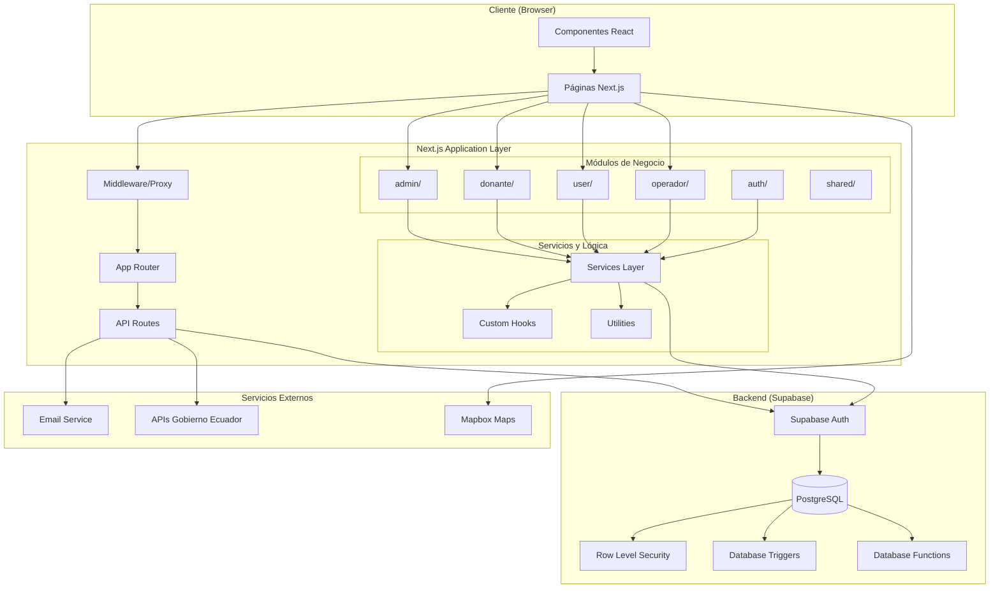
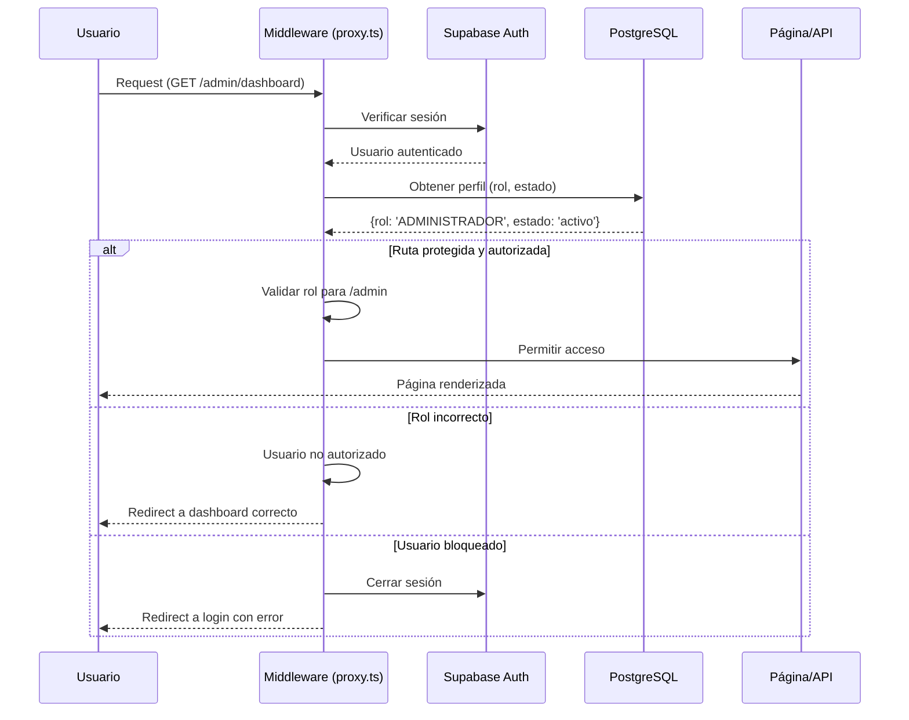

# 🏗️ Arquitectura del Sistema - Banco de Alimentos ULEAM

## Índice
- [Visión General](#visión-general)
- [Diagrama de Alto Nivel](#diagrama-de-alto-nivel)
- [Patrón de Diseño](#patrón-de-diseño)
- [Estructura de Carpetas](#estructura-de-carpetas)
- [Capas de la Aplicación](#capas-de-la-aplicación)
- [Middleware y Proxy](#middleware-y-proxy)
- [Seguridad y Autenticación](#seguridad-y-autenticación)

---

## Visión General

El Banco de Alimentos ULEAM está construido con una **arquitectura modular monolítica** que sigue los principios de **separación de responsabilidades** y **encapsulamiento**. La aplicación utiliza Next.js con App Router como framework principal, Supabase como backend, y TypeScript para garantizar type-safety en toda la aplicación.

### Características Arquitectónicas Principales

- **Modular Monolith**: Organización en módulos independientes por dominio de negocio
- **Server-Side Rendering (SSR)**: Páginas renderizadas en el servidor para mejor SEO y performance
- **API Routes**: Endpoints REST integrados en Next.js
- **Row Level Security (RLS)**: Seguridad a nivel de base de datos
- **Middleware de Autenticación**: Control de acceso centralizado
- **Arquitectura por Capas**: Separación clara entre presentación, lógica de negocio y datos

---

## Diagrama de Alto Nivel



---

## Patrón de Diseño

### 🎯 Modular Monolith Pattern

La aplicación implementa un **Modular Monolith**, que combina las ventajas de un monolito (simplicidad de despliegue, transacciones directas) con la organización modular de microservicios.

#### Características del Patrón:

1. **Módulos Independientes por Dominio**
   - Cada módulo (`admin`, `donante`, `user`, `operador`) encapsula su propia lógica
   - Los módulos se comunican a través de interfaces bien definidas
   - Posibilidad de extraer módulos a microservicios en el futuro

2. **Arquitectura en Capas (Layered Architecture)**
   ```
   ┌─────────────────────────────────────┐
   │    Presentation Layer (UI)          │ ← React Components, Pages
   ├─────────────────────────────────────┤
   │    Application Layer (Routes)       │ ← API Routes, Server Actions
   ├─────────────────────────────────────┤
   │    Business Logic Layer (Services)  │ ← Services, Hooks, Utils
   ├─────────────────────────────────────┤
   │    Data Access Layer (Supabase)     │ ← Database Client, RLS
   └─────────────────────────────────────┘
   ```

3. **Domain-Driven Design (DDD) Elements**
   - Agregados: `donaciones`, `solicitudes`, `inventario`
   - Entidades: `usuarios`, `productos_donados`, `movimientos`
   - Value Objects: Unidades de medida, estados, roles
   - Servicios de Dominio: Conversión de unidades, cálculo de impacto

---

## Estructura de Carpetas

### 📁 `/src/app` - App Router (Presentación y Rutas)

La carpeta `app` sigue la convención del **App Router de Next.js 15**, donde la estructura de carpetas define las rutas de la aplicación.

```
src/app/
├── (auth)/                    # Grupo de rutas de autenticación
│   ├── iniciar-sesion/        # Login
│   ├── registrar/             # Registro
│   ├── olvide-contrasena/     # Recuperación
│   └── verificar-email/       # Verificación
│
├── admin/                     # Panel administrativo
│   ├── dashboard/             # Dashboard admin
│   ├── catalogo/              # Gestión de catálogo
│   ├── usuarios/              # Gestión de usuarios
│   ├── configuracion/         # Configuración sistema
│   └── reportes/              # Reportes y estadísticas
│
├── donante/                   # Panel de donantes
│   ├── dashboard/             # Dashboard donante
│   ├── nueva-donacion/        # Crear donación
│   ├── donaciones/            # Historial donaciones
│   └── perfil/                # Perfil del donante
│
├── user/                      # Panel de beneficiarios
│   ├── dashboard/             # Dashboard beneficiario
│   ├── formulario/            # Solicitar alimentos
│   ├── solicitudes/           # Historial solicitudes
│   └── perfil/                # Perfil del usuario
│
├── operador/                  # Panel de operadores
│   ├── dashboard/             # Dashboard operador
│   ├── donaciones/            # Gestión donaciones
│   ├── solicitudes/           # Gestión solicitudes
│   ├── inventario/            # Control de inventario
│   └── bajas/                 # Bajas de productos
│
├── api/                       # API Routes
│   ├── auth/                  # Endpoints de autenticación
│   ├── admin/                 # Endpoints administrativos
│   ├── operador/              # Endpoints de operador
│   ├── comprobante/           # Generación de comprobantes
│   └── proxy/                 # Proxy para servicios externos
│
├── components/                # Componentes compartidos de UI
│   ├── DashboardLayout.tsx    # Layout principal
│   ├── Sidebar.tsx            # Barra lateral
│   ├── NotificacionesDropdown.tsx
│   └── ui/                    # Componentes UI básicos
│
├── page.tsx                   # Página de inicio
├── layout.tsx                 # Layout raíz
└── globals.css                # Estilos globales
```

**Principios de `app/`:**
- **Presentación pura**: Solo componentes de UI y páginas
- **Rutas protegidas**: Verificación de autenticación y roles
- **Server Components**: Por defecto, para mejor performance
- **Client Components**: Marcados con `'use client'` cuando necesario

---

### 📦 `/src/modules` - Lógica de Negocio Encapsulada

La carpeta `modules` contiene la **lógica de negocio** organizada por dominio. Cada módulo es independiente y reutilizable.

```
src/modules/
├── admin/                     # Módulo administrativo
│   ├── catalogo/              # Gestión de catálogo
│   │   ├── services/          # Lógica de negocio
│   │   ├── types/             # TypeScript types
│   │   └── utils/             # Utilidades específicas
│   ├── dashboard/             # Dashboard admin
│   │   ├── services/          # Estadísticas y métricas
│   │   └── types/             # Tipos del dashboard
│   ├── reportes/              # Sistema de reportes
│   │   ├── services/          # Generación de reportes
│   │   └── types/             # Tipos de reportes
│   └── usuarios/              # Gestión de usuarios
│       ├── services/          # CRUD usuarios
│       └── types/             # Tipos de usuario
│
├── donante/                   # Módulo de donantes
│   ├── donaciones/            # Gestión de donaciones
│   │   ├── services/          # Lógica de donaciones
│   │   ├── hooks/             # Custom hooks
│   │   └── types/             # Tipos de donaciones
│   ├── dashboard/             # Dashboard donante
│   └── perfil/                # Gestión de perfil
│
├── user/                      # Módulo de beneficiarios
│   ├── solicitudes/           # Gestión de solicitudes
│   │   ├── services/          # Lógica de solicitudes
│   │   └── types/             # Tipos de solicitudes
│   ├── hooks/                 # Custom hooks
│   └── utils/                 # Utilidades
│
├── operador/                  # Módulo de operadores
│   ├── inventario/            # Control de inventario
│   │   ├── services/          # Lógica de inventario
│   │   ├── hooks/             # Hooks de inventario
│   │   └── types/             # Tipos de inventario
│   ├── solicitudes/           # Gestión de solicitudes
│   └── bajas/                 # Bajas de productos
│
├── auth/                      # Módulo de autenticación
│   ├── services/              # AuthService
│   │   └── authService.ts     # Lógica de autenticación
│   ├── types/                 # Tipos de autenticación
│   ├── utils/                 # Validaciones
│   ├── constants/             # Constantes de auth
│   └── hooks/                 # Hooks de autenticación
│
└── shared/                    # Módulo compartido
    ├── services/              # Servicios comunes
    │   ├── notificationService.ts
    │   └── notificationClient.ts
    ├── components/            # Componentes compartidos
    ├── hooks/                 # Hooks compartidos
    └── utils/                 # Utilidades comunes
```

**Principios de `modules/`:**
- **Encapsulamiento**: Cada módulo es autocontenido
- **Separación de responsabilidades**: Services, Hooks, Types, Utils separados
- **Reutilización**: Código compartido en `shared/`
- **Type Safety**: TypeScript types exportados desde cada módulo
- **Testeable**: Lógica desacoplada de la UI

---

### 🔧 `/src/lib` - Utilidades Globales y Configuración

```
src/lib/
├── supabase.ts                # Cliente Supabase (client-side)
├── supabase-server.ts         # Cliente Supabase (server-side)
├── supabase-admin.ts          # Cliente Supabase (admin)
├── constantes.ts              # Constantes globales
├── validaciones.ts            # Esquemas de validación
├── dateUtils.ts               # Utilidades de fechas
├── unidadConversion.ts        # Conversión de unidades
├── getBaseUrl.ts              # URL base
├── configuracion-seguridad.ts # Configuración de seguridad
│
├── email/                     # Sistema de emails
│   ├── emailService.ts        # Servicio de email
│   ├── config.ts              # Configuración
│   ├── types.ts               # Tipos
│   ├── providers/             # Proveedores (Gmail, etc.)
│   └── templates/             # Plantillas de email
│
└── comprobante/               # Sistema de comprobantes
    ├── comprobanteService.ts  # Generación de comprobantes
    └── types.ts               # Tipos de comprobantes
```

---

## Capas de la Aplicación

### 1️⃣ Capa de Presentación (UI Layer)

**Ubicación**: `/src/app/*/page.tsx`, `/src/app/components/`

**Responsabilidades**:
- Renderizar la interfaz de usuario
- Capturar eventos del usuario
- Mostrar datos obtenidos de las capas inferiores
- Validación básica de formularios

**Tecnologías**:
- React (Server Components y Client Components)
- Tailwind CSS
- Lucide React (iconos)

**Ejemplo**:
```typescript
// src/app/donante/dashboard/page.tsx
export default async function DonanteDashboard() {
  // Server Component - Renderizado en el servidor
  const stats = await getDonacionesStats();
  
  return (
    <DashboardLayout>
      <StatsCards data={stats} />
      <DonacionesRecientes />
    </DashboardLayout>
  );
}
```

---

### 2️⃣ Capa de Aplicación (Application Layer)

**Ubicación**: `/src/app/api/`, `proxy.ts`

**Responsabilidades**:
- Exponer endpoints HTTP (API Routes)
- Orquestar llamadas a servicios de negocio
- Manejar autenticación y autorización
- Transformar datos entre formatos (DTO ↔ Domain)

**Tecnologías**:
- Next.js API Routes
- Middleware de Next.js

**Ejemplo**:
```typescript
// src/app/api/donaciones/route.ts
export async function POST(request: Request) {
  const supabase = await createServerSupabaseClient();
  const { data: { user } } = await supabase.auth.getUser();
  
  if (!user) {
    return NextResponse.json({ error: 'No autorizado' }, { status: 401 });
  }
  
  const donacion = await request.json();
  const result = await donacionService.crear(donacion, user.id);
  
  return NextResponse.json(result);
}
```

---

### 3️⃣ Capa de Lógica de Negocio (Business Logic Layer)

**Ubicación**: `/src/modules/*/services/`, `/src/modules/*/hooks/`

**Responsabilidades**:
- Implementar reglas de negocio
- Validar datos de dominio
- Coordinar operaciones entre entidades
- Calcular valores derivados (ej: impacto de donaciones)

**Tecnologías**:
- TypeScript classes y funciones
- Custom React Hooks

**Ejemplo**:
```typescript
// src/modules/donante/donaciones/services/donacionService.ts
export class DonacionService {
  constructor(private supabase: SupabaseClient) {}
  
  async crear(donacion: DonacionInput): Promise<DonacionResult> {
    // 1. Validar datos
    const validacion = validarDonacion(donacion);
    if (!validacion.success) throw new Error('Datos inválidos');
    
    // 2. Calcular impacto
    const impacto = calcularImpacto(donacion.cantidad, donacion.tipo);
    
    // 3. Crear en base de datos
    const { data, error } = await this.supabase
      .from('donaciones')
      .insert({ ...donacion, impacto_estimado_personas: impacto });
    
    // 4. Crear notificación
    await notificationService.crear({
      tipo: 'nueva_donacion',
      rol: 'ADMINISTRADOR',
      mensaje: `Nueva donación de ${donacion.cantidad} ${donacion.unidad}`
    });
    
    return { success: true, data };
  }
}
```

---

### 4️⃣ Capa de Acceso a Datos (Data Access Layer)

**Ubicación**: `/src/lib/supabase*.ts`, Supabase SDK

**Responsabilidades**:
- Interactuar con la base de datos
- Ejecutar queries y mutaciones
- Manejar transacciones
- Aplicar Row Level Security

**Tecnologías**:
- Supabase Client (@supabase/supabase-js)
- PostgreSQL

**Ejemplo**:
```typescript
// src/lib/supabase-server.ts
export async function createServerSupabaseClient() {
  const cookieStore = await cookies();
  
  return createServerClient(
    process.env.NEXT_PUBLIC_SUPABASE_URL!,
    process.env.NEXT_PUBLIC_SUPABASE_ANON_KEY!,
    {
      cookies: {
        get(name: string) {
          return cookieStore.get(name)?.value;
        },
      },
    }
  );
}
```

---

## Middleware y Proxy

### 📡 `proxy.ts` - Middleware de Autenticación y Autorización

El archivo `proxy.ts` actúa como un **Middleware de Next.js** que intercepta todas las peticiones antes de que lleguen a las páginas o API routes.

#### Funcionalidades Principales:

1. **Autenticación**
   - Verifica que el usuario esté autenticado
   - Valida tokens de sesión de Supabase
   - Redirige a login si no está autenticado

2. **Autorización por Rol**
   - Verifica que el usuario tenga el rol correcto para acceder a una ruta
   - Redirige al dashboard correspondiente si intenta acceder a una ruta no autorizada
   - Roles: `ADMINISTRADOR`, `OPERADOR`, `DONANTE`, `SOLICITANTE`

3. **Validación de Estado de Usuario**
   - Verifica que el usuario esté activo
   - Cierra sesión si está bloqueado o desactivado
   - Comprueba perfiles completos

4. **Gestión de Rutas Públicas**
   - Define rutas que no requieren autenticación
   - Permite acceso a `/auth/*`, `/api/public/*`, etc.

#### Flujo del Middleware:



#### Código Relevante:

```typescript
// src/proxy.ts
export async function proxy(request: NextRequest) {
  const supabase = await createServerSupabaseClient();
  const { data: { user } } = await supabase.auth.getUser();
  
  const isAuthenticated = !!user;
  const { pathname } = request.nextUrl;
  
  // Verificar si es ruta pública
  const esRutaPublica = RUTAS_PUBLICAS.some(ruta => pathname.startsWith(ruta));
  if (esRutaPublica) return NextResponse.next();
  
  // Para rutas protegidas, verificar autenticación
  if (!isAuthenticated) {
    return NextResponse.redirect(new URL('/auth/iniciar-sesion', request.url));
  }
  
  // Obtener perfil y validar autorización
  const { data: perfil } = await supabase
    .from('usuarios')
    .select('estado, rol')
    .eq('id', user.id)
    .single();
  
  // Validar estado
  if (perfil.estado === 'bloqueado' || perfil.estado === 'desactivado') {
    await supabase.auth.signOut();
    return NextResponse.redirect(new URL('/auth/iniciar-sesion?error=blocked', request.url));
  }
  
  // Validar autorización por rol
  if (pathname.startsWith('/admin') && perfil.rol !== 'ADMINISTRADOR') {
    return NextResponse.redirect(new URL(`/${perfil.rol.toLowerCase()}/dashboard`, request.url));
  }
  
  // ... validaciones similares para otros roles
  
  return NextResponse.next();
}
```

---

## Seguridad y Autenticación

### 🔐 Modelo de Seguridad Multinivel

La aplicación implementa seguridad en **múltiples capas**:

```
┌──────────────────────────────────────────┐
│  1. Middleware (proxy.ts)                │  ← Autenticación y autorización
├──────────────────────────────────────────┤
│  2. API Routes                           │  ← Validación de sesión
├──────────────────────────────────────────┤
│  3. Services                             │  ← Lógica de negocio segura
├──────────────────────────────────────────┤
│  4. Supabase RLS (Row Level Security)    │  ← Seguridad a nivel de BD
└──────────────────────────────────────────┘
```

### 1. Autenticación con Supabase Auth

- **JWT Tokens**: Tokens seguros generados por Supabase
- **Cookies HTTP-Only**: Almacenamiento seguro de tokens
- **Verificación de Email**: Requerida para activar cuenta
- **Recuperación de Contraseña**: Flujo seguro con tokens temporales

### 2. Row Level Security (RLS)

Todas las tablas de la base de datos tienen políticas RLS que garantizan:

```sql
-- Ejemplo: Política de solicitudes
CREATE POLICY "solicitudes_select_own" ON solicitudes
  FOR SELECT TO authenticated
  USING (usuario_id = auth.uid() AND rol = 'SOLICITANTE');

CREATE POLICY "solicitudes_select_admin_operador" ON solicitudes
  FOR SELECT TO authenticated
  USING (EXISTS (
    SELECT 1 FROM usuarios
    WHERE id = auth.uid() AND rol IN ('ADMINISTRADOR', 'OPERADOR')
  ));
```

**Principios RLS**:
- Los usuarios solo ven sus propios datos
- Administradores y operadores tienen acceso ampliado
- Las políticas se validan en la base de datos, no en el cliente

### 3. Validación de Roles

```typescript
// Jerarquía de roles
const ROLES = {
  ADMINISTRADOR: 'ADMINISTRADOR',  // Acceso total
  OPERADOR: 'OPERADOR',             // Gestión operativa
  DONANTE: 'DONANTE',               // Crear donaciones
  SOLICITANTE: 'SOLICITANTE',       // Solicitar alimentos
} as const;
```

### 4. Estados de Usuario

```typescript
type EstadoUsuario = 'activo' | 'bloqueado' | 'desactivado';

// Estados y sus significados:
// - activo: Usuario puede usar el sistema
// - bloqueado: Suspensión temporal o permanente
// - desactivado: Cuenta desactivada por el usuario o admin
```

---

## Conclusión

La arquitectura del Banco de Alimentos ULEAM está diseñada para ser:

- ✅ **Mantenible**: Código organizado y modular
- ✅ **Escalable**: Fácil agregar nuevos módulos o extraer a microservicios
- ✅ **Segura**: Múltiples capas de seguridad
- ✅ **Testeable**: Lógica de negocio desacoplada
- ✅ **Type-Safe**: TypeScript en toda la aplicación
- ✅ **Performante**: SSR, caching, y optimizaciones de Next.js

Esta arquitectura permite al equipo de desarrollo trabajar de forma independiente en diferentes módulos mientras mantiene la coherencia del sistema.
