# 🗄️ Base de Datos - Banco de Alimentos ULEAM

## Índice
- [Visión General](#visión-general)
- [Diagrama Entidad-Relación](#diagrama-entidad-relación)
- [Tablas Principales](#tablas-principales)
- [Diccionario de Datos](#diccionario-de-datos)
- [Relaciones y Cardinalidad](#relaciones-y-cardinalidad)
- [Funciones y Triggers](#funciones-y-triggers)
- [Row Level Security (RLS)](#row-level-security-rls)
- [Vistas Materializadas](#vistas-materializadas)
- [Índices y Optimización](#índices-y-optimización)

---

## Visión General

El sistema utiliza **PostgreSQL** como motor de base de datos, gestionado a través de **Supabase**. La base de datos está diseñada con los siguientes principios:

### Características Principales:

- ✅ **Normalización 3NF**: Evita redundancia de datos
- ✅ **Integridad Referencial**: Foreign keys en todas las relaciones
- ✅ **Row Level Security (RLS)**: Seguridad a nivel de fila
- ✅ **Triggers Automáticos**: Automatización de lógica de negocio
- ✅ **Funciones Almacenadas**: Lógica compleja en la BD
- ✅ **Vistas**: Consultas complejas simplificadas
- ✅ **Índices Optimizados**: Para queries frecuentes

### Tecnologías:

- **PostgreSQL**: Motor de base de datos
- **Supabase**: Backend-as-a-Service
- **UUID**: Para claves primarias
- **JSONB**: Para metadatos flexibles
- **Extensions**: pg_graphql, pgcrypto, uuid-ossp

---

## Diagrama Entidad-Relación


---

## Tablas Principales

### 👥 usuarios

**Propósito**: Gestión de perfiles de usuarios del sistema

| Columna | Tipo | Descripción | Restricciones |
|---------|------|-------------|---------------|
| id | uuid | Identificador único (FK a auth.users) | PK, NOT NULL |
| email | text | Email del usuario | |
| rol | text | Rol del usuario | CHECK: ADMINISTRADOR, DONANTE, SOLICITANTE, OPERADOR |
| tipo_persona | text | Tipo de persona | Natural o Jurídica |
| nombre | text | Nombre completo o razón social | |
| cedula | text | Cédula de identidad | UNIQUE (si no null) |
| ruc | text | RUC (personas jurídicas) | |
| telefono | text | Teléfono de contacto | |
| direccion | text | Dirección física | |
| latitud | double precision | Coordenada geográfica | |
| longitud | double precision | Coordenada geográfica | |
| estado | varchar(20) | Estado de la cuenta | CHECK: activo, bloqueado, desactivado |
| recibir_notificaciones | boolean | Preferencia de notificaciones | DEFAULT true |
| fecha_fin_bloqueo | timestamp | Fin de bloqueo temporal | |
| motivo_bloqueo | text | Razón del bloqueo | |
| created_at | timestamp | Fecha de creación | DEFAULT now() |
| updated_at | timestamp | Última actualización | DEFAULT now() |

**Índices**:
- `idx_usuarios_estado` en `estado`
- `unique_cedula_idx` en `cedula` (único si no nulo)

---

### 🎁 donaciones

**Propósito**: Registro de donaciones de alimentos

| Columna | Tipo | Descripción | Restricciones |
|---------|------|-------------|---------------|
| id | integer | Identificador único | PK, SERIAL |
| user_id | uuid | ID del donante | FK a usuarios |
| nombre_donante | text | Nombre del donante | NOT NULL |
| ruc_donante | text | RUC (si aplica) | |
| cedula_donante | text | Cédula (si aplica) | |
| tipo_persona_donante | text | Natural o Jurídica | |
| alimento_id | integer | ID del alimento | FK a alimentos |
| tipo_producto | text | Nombre del producto | NOT NULL |
| categoria_comida | text | Categoría del alimento | NOT NULL |
| es_producto_personalizado | boolean | Si es producto custom | DEFAULT false |
| cantidad | numeric(10,2) | Cantidad donada | CHECK > 0 |
| unidad_id | integer | Unidad de medida | FK a unidades, NOT NULL |
| unidad_nombre | text | Nombre de la unidad | |
| unidad_simbolo | text | Símbolo de la unidad | |
| fecha_vencimiento | date | Fecha de caducidad | |
| fecha_disponible | date | Disponible para recoger | NOT NULL |
| direccion_entrega | text | Dirección de recogida | NOT NULL |
| horario_preferido | text | Horario preferido | |
| observaciones | text | Comentarios adicionales | |
| impacto_estimado_personas | integer | Personas alimentadas | |
| impacto_equivalente | text | Equivalente en comidas | |
| estado | text | Estado de la donación | CHECK: Pendiente, Recogida, Entregada, Cancelada |
| codigo_comprobante | text | Código único del comprobante (generado por la capa de aplicación) | |
| motivo_cancelacion | text | Razón de cancelación | CHECK: error_donante, no_disponible, etc. |
| observaciones_cancelacion | text | Detalles de cancelación | |
| usuario_cancelacion_id | uuid | Quien canceló | FK a auth.users |
| fecha_cancelacion | timestamp | Cuándo se canceló | |
| creado_en | timestamp | Fecha de creación | DEFAULT now() |
| actualizado_en | timestamp | Última actualización | DEFAULT now() |

**Índices**:
- `idx_donaciones_user_id` en `user_id`
- `idx_donaciones_estado` en `estado`
- `idx_donaciones_alimento_id` en `alimento_id`
- `idx_donaciones_unidad_id` en `unidad_id`
- `idx_donaciones_codigo_comprobante` en `codigo_comprobante`

**Triggers**:
- `trigger_crear_producto`: Crea producto en inventario cuando estado = 'Entregada'
- `trigger_donacion_notificacion`: Crea notificaciones automáticas

---

### 📋 solicitudes

**Propósito**: Solicitudes de alimentos por beneficiarios

| Columna | Tipo | Descripción | Restricciones |
|---------|------|-------------|---------------|
| id | uuid | Identificador único | PK, DEFAULT gen_random_uuid() |
| usuario_id | uuid | ID del solicitante | FK a usuarios, NOT NULL |
| tipo_alimento | text | Tipo de alimento solicitado | NOT NULL |
| cantidad | numeric | Cantidad solicitada | NOT NULL |
| unidad_id | bigint | Unidad de medida | FK a unidades |
| comentarios | text | Comentarios adicionales | |
| latitud | double precision | Coordenada de entrega | |
| longitud | double precision | Coordenada de entrega | |
| estado | text | Estado de la solicitud | CHECK: pendiente, aprobada, rechazada, entregada |
| codigo_comprobante | text | Código del comprobante (generado por la capa de aplicación) | |
| cantidad_entregada | numeric(10,2) | Cantidad ya entregada | DEFAULT 0 |
| tiene_entregas_parciales | boolean | Si tiene entregas parciales | DEFAULT false |
| fecha_respuesta | timestamp | Cuándo se respondió | |
| comentario_admin | text | Comentario del operador | |
| motivo_rechazo | text | Razón del rechazo | |
| operador_rechazo_id | uuid | Quien rechazó | FK a usuarios |
| fecha_rechazo | timestamp | Cuándo se rechazó | |
| operador_aprobacion_id | uuid | Quien aprobó | FK a usuarios |
| fecha_aprobacion | timestamp | Cuándo se aprobó | |
| created_at | timestamp | Fecha de creación | DEFAULT now() |

**Índices**:
- `idx_solicitudes_id_usuario` en `usuario_id`
- `idx_solicitudes_estado_fecha_respuesta` en `estado, fecha_respuesta`
- `idx_solicitudes_unidad_id` en `unidad_id`
- `idx_solicitudes_codigo_comprobante` en `codigo_comprobante`

**Triggers**:
- `trigger_solicitud_notificacion`: Crea notificaciones automáticas

---

### 📦 productos_donados

**Propósito**: Catálogo de productos donados disponibles

| Columna | Tipo | Descripción | Restricciones |
|---------|------|-------------|---------------|
| id_producto | uuid | Identificador único | PK, DEFAULT gen_random_uuid() |
| id_usuario | uuid | ID del donante original | FK a usuarios |
| nombre_producto | text | Nombre del producto | |
| descripcion | text | Descripción del producto | |
| cantidad | numeric | Cantidad total | |
| alimento_id | bigint | Tipo de alimento | FK a alimentos |
| unidad_id | bigint | Unidad de medida | FK a unidades |
| unidad_medida | text | Nombre de la unidad (legacy) | |
| fecha_caducidad | timestamp | Fecha de vencimiento | |
| fecha_donacion | timestamp | Cuándo se donó | DEFAULT now() |

**Índices**:
- `idx_productos_id_usuario` en `id_usuario`
- `idx_productos_donados_alimento_id` en `alimento_id`
- `idx_productos_donados_unidad` en `unidad_id`
- `idx_productos_nombre_unidad` UNIQUE en `lower(trim(nombre_producto)), unidad_id`

**Constraint Único**:
- Previene duplicados de productos con mismo nombre (normalizado) y unidad

---

### 📊 inventario

**Propósito**: Stock disponible de productos por depósito

| Columna | Tipo | Descripción | Restricciones |
|---------|------|-------------|---------------|
| id_inventario | uuid | Identificador único | PK, DEFAULT gen_random_uuid() |
| id_deposito | uuid | Depósito donde está | FK a depositos, NOT NULL |
| id_producto | uuid | Producto almacenado | FK a productos_donados, NOT NULL |
| cantidad_disponible | numeric | Stock actual | DEFAULT 0, NOT NULL |
| fecha_actualizacion | timestamp | Última actualización | DEFAULT now() |

**Índices**:
- `inventario_id_deposito_id_producto_key` UNIQUE en `id_deposito, id_producto`
- `idx_inventario_id_producto` en `id_producto`

**Constraint Único**:
- Un producto solo puede aparecer una vez por depósito

---

### 🏢 depositos

**Propósito**: Almacenes donde se guarda el inventario

| Columna | Tipo | Descripción | Restricciones |
|---------|------|-------------|---------------|
| id_deposito | uuid | Identificador único | PK, DEFAULT gen_random_uuid() |
| nombre | text | Nombre del depósito | NOT NULL |
| descripcion | text | Descripción del depósito | |

---

### 📝 movimiento_inventario_cabecera

**Propósito**: Encabezado de movimientos de inventario (trazabilidad)

| Columna | Tipo | Descripción | Restricciones |
|---------|------|-------------|---------------|
| id_movimiento | uuid | Identificador único | PK, DEFAULT gen_random_uuid() |
| fecha_movimiento | timestamp | Cuándo ocurrió | DEFAULT now() |
| id_donante | uuid | Usuario que dona/registra | FK a usuarios, NOT NULL |
| id_solicitante | uuid | Usuario que recibe | FK a usuarios, NOT NULL |
| estado_movimiento | text | Estado del movimiento | CHECK: pendiente, completado, donado |
| observaciones | text | Comentarios | |

**Índices**:
- `idx_movimiento_donante` en `id_donante`
- `idx_movimiento_solicitante` en `id_solicitante`

---

### 📄 movimiento_inventario_detalle

**Propósito**: Detalle de cada línea de movimiento

| Columna | Tipo | Descripción | Restricciones |
|---------|------|-------------|---------------|
| id_detalle | uuid | Identificador único | PK, DEFAULT gen_random_uuid() |
| id_movimiento | uuid | Movimiento al que pertenece | FK a movimiento_inventario_cabecera, NOT NULL |
| id_producto | uuid | Producto movido | FK a productos_donados, NOT NULL |
| cantidad | numeric | Cantidad movida | NOT NULL |
| unidad_id | bigint | Unidad de medida | FK a unidades |
| tipo_transaccion | text | Tipo de movimiento | CHECK: ingreso, egreso, baja |
| rol_usuario | text | Rol del responsable | CHECK: donante, beneficiario, distribuidor |
| observacion_detalle | text | Comentarios de la línea | |

**Índices**:
- `idx_detalle_movimiento` en `id_movimiento`
- `idx_detalle_producto` en `id_producto`
- `idx_movimiento_detalle_unidad` en `unidad_id`

---

### 🍎 alimentos

**Propósito**: Catálogo de alimentos permitidos

| Columna | Tipo | Descripción | Restricciones |
|---------|------|-------------|---------------|
| id | bigint | Identificador único | PK, SERIAL |
| nombre | text | Nombre del alimento | NOT NULL |
| categoria | text | Categoría del alimento | |
| created_at | timestamp | Fecha de creación | DEFAULT now() |
| updated_at | timestamp | Última actualización | DEFAULT now() |

**Índices**:
- `idx_alimentos_nombre` en `nombre`
- `idx_alimentos_categoria` en `categoria`

---

### 📏 unidades

**Propósito**: Unidades de medida del sistema

| Columna | Tipo | Descripción | Restricciones |
|---------|------|-------------|---------------|
| id | bigint | Identificador único | PK, SERIAL |
| nombre | text | Nombre de la unidad | NOT NULL |
| simbolo | text | Símbolo de la unidad | NOT NULL |
| tipo_magnitud_id | bigint | Tipo de magnitud | FK a tipos_magnitud, NOT NULL |
| es_base | boolean | Si es unidad base | DEFAULT false |
| created_at | timestamp | Fecha de creación | DEFAULT now() |

**Índices**:
- `idx_unidades_nombre` en `nombre`
- `idx_unidades_simbolo` en `simbolo`
- `idx_unidades_tipo_magnitud` en `tipo_magnitud_id`

**Ejemplos**:
- Masa: kg, g, lb, oz (base: kg)
- Volumen: L, mL, gal (base: L)
- Unidad: unidades, docenas, cajas (base: unidad)

---

### 🔄 conversiones

**Propósito**: Factores de conversión entre unidades

| Columna | Tipo | Descripción | Restricciones |
|---------|------|-------------|---------------|
| id | bigint | Identificador único | PK, SERIAL |
| unidad_origen_id | bigint | Unidad de origen | FK a unidades, NOT NULL |
| unidad_destino_id | bigint | Unidad de destino | FK a unidades, NOT NULL |
| factor_conversion | numeric(15,8) | Factor de conversión | NOT NULL |
| created_at | timestamp | Fecha de creación | DEFAULT now() |

**Constraint**:
- `conversiones_unidades_diferentes`: unidad_origen_id ≠ unidad_destino_id
- `conversiones_unicas` UNIQUE en `unidad_origen_id, unidad_destino_id`

**Ejemplo**:
```sql
-- 1 kg = 1000 g
INSERT INTO conversiones (unidad_origen_id, unidad_destino_id, factor_conversion)
VALUES (1, 2, 1000);

-- 1 L = 1000 mL
INSERT INTO conversiones (unidad_origen_id, unidad_destino_id, factor_conversion)
VALUES (5, 6, 1000);
```

---

### 🔔 notificaciones

**Propósito**: Sistema de notificaciones del sistema

| Columna | Tipo | Descripción | Restricciones |
|---------|------|-------------|---------------|
| id | uuid | Identificador único | PK, DEFAULT gen_random_uuid() |
| titulo | varchar(255) | Título de la notificación | NOT NULL |
| mensaje | text | Contenido de la notificación | NOT NULL |
| tipo | varchar(50) | Tipo de notificación | DEFAULT 'info' |
| destinatario_id | uuid | Usuario destinatario | FK a usuarios |
| rol_destinatario | varchar(50) | Rol destinatario | |
| categoria | varchar(100) | Categoría de la notificación | NOT NULL |
| leida | boolean | Si fue leída | DEFAULT false |
| activa | boolean | Si está activa | DEFAULT true |
| url_accion | varchar(500) | URL al hacer clic | |
| metadatos | jsonb | Datos adicionales | DEFAULT '{}' |
| fecha_creacion | timestamp | Cuándo se creó | DEFAULT now() |
| fecha_leida | timestamp | Cuándo se leyó | |
| expira_en | timestamp | Cuándo expira | |

**Índices**:
- `idx_notificaciones_destinatario` en `destinatario_id`
- `idx_notificaciones_rol` en `rol_destinatario`
- `idx_notificaciones_leida` en `leida`
- `idx_notificaciones_activa` en `activa`
- `idx_notificaciones_categoria` en `categoria`
- `idx_notificaciones_fecha_creacion` en `fecha_creacion DESC`

---

### ⚠️ bajas_productos

**Propósito**: Registro de bajas de inventario

| Columna | Tipo | Descripción | Restricciones |
|---------|------|-------------|---------------|
| id_baja | uuid | Identificador único | PK, DEFAULT gen_random_uuid() |
| id_producto | uuid | Producto dado de baja | FK a productos_donados, NOT NULL |
| id_inventario | uuid | Registro de inventario | FK a inventario, NOT NULL |
| id_deposito | uuid | Depósito donde estaba | FK a depositos |
| cantidad_baja | numeric | Cantidad dada de baja | CHECK > 0, NOT NULL |
| motivo_baja | text | Razón de la baja | CHECK: vencido, dañado, contaminado, rechazado, otro |
| usuario_responsable_id | uuid | Quien registró la baja | FK a usuarios, NOT NULL |
| observaciones | text | Comentarios adicionales | |
| estado_baja | text | Estado del registro | CHECK: confirmada, pendiente_revision, revisada |
| nombre_producto | text | Nombre del producto | |
| cantidad_disponible_antes | numeric | Stock antes de la baja | |
| fecha_baja | timestamp | Cuándo se registró | DEFAULT now() |
| created_at | timestamp | Fecha de creación | DEFAULT now() |
| updated_at | timestamp | Última actualización | DEFAULT now() |

**Índices**:
- `idx_bajas_productos_producto` en `id_producto`
- `idx_bajas_productos_usuario` en `usuario_responsable_id`
- `idx_bajas_productos_fecha` en `fecha_baja DESC`
- `idx_bajas_productos_motivo` en `motivo_baja`
- `idx_bajas_productos_estado` en `estado_baja`

---

## Relaciones y Cardinalidad

### Relaciones Principales:

```
usuarios (1) ──── (N) donaciones
  "Un usuario puede crear muchas donaciones"

usuarios (1) ──── (N) solicitudes
  "Un usuario puede tener muchas solicitudes"

donaciones (N) ──── (1) alimentos
  "Muchas donaciones de un tipo de alimento"

productos_donados (N) ──── (1) alimentos
  "Muchos productos de un tipo de alimento"

productos_donados (N) ──── (1) unidades
  "Muchos productos con una unidad de medida"

inventario (N) ──── (1) depositos
  "Muchos productos en un depósito"

inventario (N) ──── (1) productos_donados
  "Muchos registros de inventario de un producto"

movimiento_inventario_cabecera (1) ──── (N) movimiento_inventario_detalle
  "Un movimiento tiene muchas líneas de detalle"

alimentos (N) ──── (N) unidades (a través de alimentos_unidades)
  "Muchos alimentos pueden usar muchas unidades"

unidades (N) ──── (N) unidades (a través de conversiones)
  "Una unidad puede convertirse a muchas otras"
```

---

## Funciones y Triggers

### 🔧 Funciones Principales

#### 1. `crear_notificacion()`

**Propósito**: Crear notificaciones de forma segura

```sql
CREATE FUNCTION crear_notificacion(
  p_titulo VARCHAR,
  p_mensaje TEXT,
  p_tipo VARCHAR,
  p_destinatario_id UUID,
  p_rol_destinatario VARCHAR,
  p_categoria VARCHAR,
  p_url_accion VARCHAR DEFAULT NULL,
  p_metadatos JSONB DEFAULT '{}'
) RETURNS UUID
SECURITY DEFINER
AS $$
DECLARE
  v_notificacion_id uuid;
BEGIN
  INSERT INTO notificaciones (
    titulo, mensaje, tipo, destinatario_id,
    rol_destinatario, categoria, url_accion, metadatos
  ) VALUES (
    p_titulo, p_mensaje, p_tipo, p_destinatario_id,
    p_rol_destinatario, p_categoria, p_url_accion, p_metadatos
  )
  RETURNING id INTO v_notificacion_id;
  
  RETURN v_notificacion_id;
END;
$$;
```

---

#### 2. `crear_producto_desde_donacion()`

**Propósito**: Actualizar inventario cuando una donación es entregada

```sql
CREATE FUNCTION crear_producto_desde_donacion() 
RETURNS TRIGGER
SECURITY DEFINER
AS $$
DECLARE
  v_producto_id uuid;
  v_deposito_id uuid;
BEGIN
  IF NEW.estado = 'Entregada' THEN
    -- Obtener primer depósito disponible
    SELECT id_deposito INTO v_deposito_id
    FROM depositos LIMIT 1;
    
    -- Buscar producto existente
    SELECT id_producto INTO v_producto_id
    FROM productos_donados
    WHERE lower(trim(nombre_producto)) = lower(trim(NEW.tipo_producto))
      AND unidad_id = NEW.unidad_id;
    
    IF v_producto_id IS NOT NULL THEN
      -- Actualizar cantidad existente
      UPDATE productos_donados
      SET cantidad = cantidad + NEW.cantidad
      WHERE id_producto = v_producto_id;
    ELSE
      -- Insertar nuevo producto
      INSERT INTO productos_donados (...)
      VALUES (...)
      RETURNING id_producto INTO v_producto_id;
    END IF;
    
    -- Actualizar o insertar en inventario
    IF EXISTS (SELECT 1 FROM inventario WHERE ...) THEN
      UPDATE inventario SET cantidad_disponible = cantidad_disponible + NEW.cantidad;
    ELSE
      INSERT INTO inventario (...) VALUES (...);
    END IF;
  END IF;
  
  RETURN NEW;
END;
$$;
```

---

#### 3. `dar_baja_producto()`

**Propósito**: Dar de baja productos y actualizar inventario (transacción atómica)

**Diagrama de Flujo Transaccional**:

```mermaid
sequenceDiagram
    participant App as App/API
    participant Func as FN dar_baja_producto()
    participant Inv as Tabla Inventario
    participant Bajas as Tabla Bajas
    participant Movs as Tablas Movimientos
    
    App->>Func: Ejecutar (ID, Cantidad, Motivo)
    
    rect rgb(30, 30, 30)
    Note right of Func: Transacción Atómica
    Func->>Inv: Verificar Stock actual
    
    alt Stock Insuficiente
        Func-->>App: Error (False)
    else Stock Suficiente
        Func->>Bajas: Insertar Registro Baja
        Func->>Inv: UPDATE cantidad - baja
        Func->>Movs: INSERT Cabecera Movimiento
        Func->>Movs: INSERT Detalle Movimiento
        Func-->>App: Éxito (True, ID_Baja)
    end
    end
```



**Código SQL**:

```sql
CREATE FUNCTION dar_baja_producto(
  p_id_inventario UUID,
  p_cantidad NUMERIC,
  p_motivo TEXT,
  p_usuario_id UUID,
  p_observaciones TEXT DEFAULT NULL
)
RETURNS TABLE(success BOOLEAN, message TEXT, id_baja UUID, cantidad_restante NUMERIC)
AS $$
DECLARE
  v_cantidad_actual numeric;
  v_nueva_cantidad numeric;
  v_id_baja uuid;
BEGIN
  -- Validar motivo
  IF p_motivo NOT IN ('vencido', 'dañado', 'contaminado', 'rechazado', 'otro') THEN
    RETURN QUERY SELECT false, 'Motivo inválido', NULL::uuid, NULL::numeric;
    RETURN;
  END IF;
  
  -- Obtener cantidad actual
  SELECT cantidad_disponible INTO v_cantidad_actual
  FROM inventario WHERE id_inventario = p_id_inventario;
  
  -- Verificar suficiente cantidad
  IF v_cantidad_actual < p_cantidad THEN
    RETURN QUERY SELECT false, 'Cantidad insuficiente', NULL::uuid, v_cantidad_actual;
    RETURN;
  END IF;
  
  -- Calcular nueva cantidad
  v_nueva_cantidad := v_cantidad_actual - p_cantidad;
  
  -- Registrar baja
  INSERT INTO bajas_productos (...)
  VALUES (...)
  RETURNING id_baja INTO v_id_baja;
  
  -- Actualizar inventario
  UPDATE inventario 
  SET cantidad_disponible = v_nueva_cantidad
  WHERE id_inventario = p_id_inventario;
  
  -- Registrar movimiento
  INSERT INTO movimiento_inventario_cabecera (...) VALUES (...);
  INSERT INTO movimiento_inventario_detalle (...) VALUES (...);
  
  RETURN QUERY SELECT true, 'Baja exitosa', v_id_baja, v_nueva_cantidad;
END;
$$;
```

---

#### 4. `convertir_cantidad()`

**Propósito**: Convertir cantidades entre unidades de medida

```sql
CREATE FUNCTION convertir_cantidad(
  p_cantidad NUMERIC,
  p_unidad_origen_id BIGINT,
  p_unidad_destino_id BIGINT
)
RETURNS NUMERIC
AS $$
DECLARE
  v_factor_conversion numeric;
BEGIN
  -- Si son la misma unidad, no convertir
  IF p_unidad_origen_id = p_unidad_destino_id THEN
    RETURN p_cantidad;
  END IF;
  
  -- Buscar factor de conversión directo
  SELECT factor_conversion INTO v_factor_conversion
  FROM conversiones
  WHERE unidad_origen_id = p_unidad_origen_id
    AND unidad_destino_id = p_unidad_destino_id;
  
  IF FOUND THEN
    RETURN p_cantidad * v_factor_conversion;
  END IF;
  
  -- Buscar factor inverso
  SELECT 1.0 / factor_conversion INTO v_factor_conversion
  FROM conversiones
  WHERE unidad_origen_id = p_unidad_destino_id
    AND unidad_destino_id = p_unidad_origen_id;
  
  IF FOUND THEN
    RETURN p_cantidad * v_factor_conversion;
  END IF;
  
  -- No se encontró conversión
  RETURN NULL;
END;
$$;
```

---

#### 5. Funciones Auxiliares (Placeholder / WIP)

Las siguientes funciones están implementadas como **placeholders** y requieren lógica de negocio completa:

##### `cancelar_eliminacion_categoria()`

**Estado**: ⚠️ **Implementación Placeholder / WIP**

```sql
CREATE FUNCTION cancelar_eliminacion_categoria(p_categoria_id BIGINT)
RETURNS BOOLEAN
AS $$
BEGIN
  -- TODO: Implementar lógica de cancelación
  RETURN true;  -- Actualmente solo retorna true
END;
$$;
```

**Pendiente de implementar**:
- Validación de permisos del usuario
- Verificación del estado de la categoría
- Actualización de registros relacionados
- Registro en auditoría

##### `procesar_eliminaciones_categorias_pendientes()`

**Estado**: ⚠️ **Implementación Placeholder / WIP**

```sql
CREATE FUNCTION procesar_eliminaciones_categorias_pendientes()
RETURNS VOID
AS $$
BEGIN
  -- TODO: Implementar lógica de procesamiento batch
  -- Actualmente sin implementación
  RETURN;
END;
$$;
```

**Pendiente de implementar**:
- Lógica de procesamiento por lotes
- Eliminación segura de categorías marcadas
- Reasignación de productos huérfanos
- Registro de eliminaciones ejecutadas

> 💡 **Nota**: Estas funciones fueron creadas para funcionalidad futura y actualmente no contienen lógica de negocio. Se recomienda implementarlas completamente antes de usarlas en producción.

---

### 🔔 Triggers Principales

#### 1. `trigger_crear_producto`

```sql
CREATE TRIGGER trigger_crear_producto
  AFTER INSERT OR UPDATE ON donaciones
  FOR EACH ROW
  EXECUTE FUNCTION crear_producto_desde_donacion();
```

**Cuándo se ejecuta**: Cuando una donación cambia a estado "Entregada"

**Qué hace**:
1. Busca o crea el producto en `productos_donados`
2. Actualiza o inserta en `inventario`
3. Normaliza nombres para prevenir duplicados

---

#### 2. `trigger_donacion_notificacion`

```sql
CREATE TRIGGER trigger_donacion_notificacion
  AFTER INSERT OR UPDATE ON donaciones
  FOR EACH ROW
  EXECUTE FUNCTION trigger_notificacion_donacion();
```

**Cuándo se ejecuta**: Al crear o actualizar una donación

**Qué hace**:
1. Crea notificación para operadores cuando hay nueva donación
2. Notifica al donante cuando cambia el estado
3. Incluye metadatos relevantes (ID, cantidad, producto)

---

#### 3. `trigger_solicitud_notificacion`

```sql
CREATE TRIGGER trigger_solicitud_notificacion
  AFTER INSERT OR UPDATE ON solicitudes
  FOR EACH ROW
  EXECUTE FUNCTION trigger_notificacion_solicitud();
```

**Cuándo se ejecuta**: Al crear o actualizar una solicitud

**Qué hace**:
1. Notifica a operadores cuando hay nueva solicitud
2. Notifica al solicitante cuando es aprobada/rechazada
3. Genera comprobante si es aprobada

---

## Row Level Security (RLS)

Todas las tablas tienen RLS habilitado para garantizar seguridad a nivel de fila.

### Políticas de `usuarios`

```sql
-- Ver: Solo propio perfil o si eres admin/operador
CREATE POLICY "usuarios_select_policy" ON usuarios
  FOR SELECT TO authenticated
  USING (
    id = auth.uid() 
    OR (get_user_role() IN ('ADMINISTRADOR', 'OPERADOR') AND get_user_estado() = 'activo')
  );

-- Insertar: Solo el propio usuario al registrarse
CREATE POLICY "usuarios_insert_policy" ON usuarios
  FOR INSERT TO authenticated
  WITH CHECK (id = auth.uid());

-- Actualizar: Propio perfil o admin
CREATE POLICY "usuarios_update_policy" ON usuarios
  FOR UPDATE TO authenticated
  USING (
    id = auth.uid() 
    OR (get_user_role() = 'ADMINISTRADOR' AND get_user_estado() = 'activo')
  );
```

---

### Políticas de `donaciones`

```sql
-- Donante puede ver sus propias donaciones
CREATE POLICY "donante_select_own_donaciones" ON donaciones
  FOR SELECT USING (auth.uid() = user_id);

-- Admin puede ver todas las donaciones
CREATE POLICY "admin_select_donaciones" ON donaciones
  FOR SELECT USING (
    EXISTS (SELECT 1 FROM usuarios WHERE id = auth.uid() AND rol = 'ADMINISTRADOR')
  );

-- Operador puede ver todas las donaciones
CREATE POLICY "operador_select_donaciones" ON donaciones
  FOR SELECT TO authenticated USING (
    EXISTS (SELECT 1 FROM usuarios WHERE id = auth.uid() AND rol = 'OPERADOR')
  );

-- Donante puede crear donaciones
CREATE POLICY "donante_insert_donaciones" ON donaciones
  FOR INSERT WITH CHECK (true);

-- Donante puede actualizar sus donaciones pendientes
CREATE POLICY "Donantes pueden actualizar sus propias donaciones pendientes" ON donaciones
  FOR UPDATE USING (auth.uid() = user_id AND estado = 'Pendiente')
  WITH CHECK (auth.uid() = user_id AND estado = 'Pendiente');
```

---

### Políticas de `inventario`

```sql
-- Usuarios activos pueden ver inventario
CREATE POLICY "inventario_select_usuarios_activos" ON inventario
  FOR SELECT TO authenticated USING (
    EXISTS (SELECT 1 FROM usuarios WHERE id = auth.uid() AND estado = 'activo')
  );

-- Solo admin/operador pueden modificar
CREATE POLICY "inventario_update_admin_operador" ON inventario
  FOR UPDATE TO authenticated USING (
    EXISTS (SELECT 1 FROM usuarios 
            WHERE id = auth.uid() 
            AND rol IN ('ADMINISTRADOR', 'OPERADOR') 
            AND estado = 'activo')
  );
```

---

## Vistas Materializadas

### 📊 v_inventario_detallado

**Propósito**: Vista completa del inventario con información de unidades

```sql
CREATE VIEW v_inventario_detallado AS
SELECT 
  i.id_inventario,
  i.id_deposito,
  d.nombre AS nombre_deposito,
  i.id_producto,
  pd.nombre_producto,
  pd.alimento_id,
  a.nombre AS nombre_alimento,
  a.categoria AS categoria_alimento,
  i.cantidad_disponible,
  pd.unidad_id,
  u.nombre AS unidad_nombre,
  u.simbolo AS unidad_simbolo,
  pd.fecha_caducidad,
  pd.fecha_donacion,
  i.fecha_actualizacion
FROM inventario i
JOIN depositos d ON i.id_deposito = d.id_deposito
JOIN productos_donados pd ON i.id_producto = pd.id_producto
LEFT JOIN alimentos a ON pd.alimento_id = a.id
LEFT JOIN unidades u ON pd.unidad_id = u.id
ORDER BY i.fecha_actualizacion DESC;
```

---

### 🔄 v_movimientos_detallado

**Propósito**: Vista completa de movimientos con información estructurada

```sql
CREATE VIEW v_movimientos_detallado AS
SELECT 
  mic.id_movimiento,
  mic.fecha_movimiento,
  mic.estado_movimiento,
  mic.observaciones AS observaciones_cabecera,
  mid.id_detalle,
  mid.cantidad,
  mid.tipo_transaccion,
  mid.rol_usuario,
  mid.observacion_detalle,
  mid.id_producto,
  pd.nombre_producto,
  pd.alimento_id,
  a.nombre AS nombre_alimento,
  a.categoria AS categoria_alimento,
  COALESCE(mid.unidad_id, pd.unidad_id) AS unidad_id_utilizada,
  COALESCE(u_detalle.nombre, u_producto.nombre) AS unidad_nombre,
  COALESCE(u_detalle.simbolo, u_producto.simbolo) AS unidad_simbolo,
  udon.nombre AS nombre_donante,
  usol.nombre AS nombre_solicitante
FROM movimiento_inventario_cabecera mic
JOIN movimiento_inventario_detalle mid ON mic.id_movimiento = mid.id_movimiento
JOIN productos_donados pd ON mid.id_producto = pd.id_producto
LEFT JOIN alimentos a ON pd.alimento_id = a.id
LEFT JOIN unidades u_detalle ON mid.unidad_id = u_detalle.id
LEFT JOIN unidades u_producto ON pd.unidad_id = u_producto.id
LEFT JOIN usuarios udon ON mic.id_donante = udon.id
LEFT JOIN usuarios usol ON mic.id_solicitante = usol.id
ORDER BY mic.fecha_movimiento DESC;
```

---

## Índices y Optimización

### Índices Principales:

#### 1. **Índices de Búsqueda Frecuente**

```sql
-- Búsqueda de donaciones por usuario y estado
CREATE INDEX idx_donaciones_user_id ON donaciones(user_id);
CREATE INDEX idx_donaciones_estado ON donaciones(estado);

-- Búsqueda de solicitudes
CREATE INDEX idx_solicitudes_id_usuario ON solicitudes(usuario_id);
CREATE INDEX idx_solicitudes_estado_fecha_respuesta ON solicitudes(estado, fecha_respuesta);

-- Búsqueda de productos
CREATE INDEX idx_productos_id_usuario ON productos_donados(id_usuario);
CREATE INDEX idx_productos_donados_alimento_id ON productos_donados(alimento_id);
```

---

#### 2. **Índices de Integridad Referencial**

```sql
-- Acelerar JOINs entre tablas
CREATE INDEX idx_inventario_id_producto ON inventario(id_producto);
CREATE INDEX idx_detalle_movimiento ON movimiento_inventario_detalle(id_movimiento);
CREATE INDEX idx_detalle_producto ON movimiento_inventario_detalle(id_producto);
```

---

#### 3. **Índices de Ordenamiento**

```sql
-- Ordenar por fecha
CREATE INDEX idx_donaciones_fecha_disponible ON donaciones(fecha_disponible);
CREATE INDEX idx_bajas_productos_fecha ON bajas_productos(fecha_baja DESC);
CREATE INDEX idx_notificaciones_fecha_creacion ON notificaciones(fecha_creacion DESC);
```

---

#### 4. **Índices Únicos**

```sql
-- Prevenir duplicados
CREATE UNIQUE INDEX idx_productos_nombre_unidad 
  ON productos_donados(lower(trim(nombre_producto)), unidad_id);

CREATE UNIQUE INDEX unique_cedula_idx 
  ON usuarios(cedula) WHERE cedula IS NOT NULL AND cedula <> '';

CREATE UNIQUE INDEX conversiones_unicas 
  ON conversiones(unidad_origen_id, unidad_destino_id);
```

---

### Estrategias de Optimización:

1. **Índices Compuestos**: Para queries frecuentes que filtran por múltiples columnas
2. **Índices Parciales**: Solo indexar filas que cumplen ciertas condiciones
3. **Vistas**: Simplificar queries complejas repetitivas
4. **Triggers**: Automatizar operaciones y reducir lógica en el cliente
5. **RLS**: Seguridad sin impacto en queries (se aplica automáticamente)

---

## Conclusión

La base de datos del Banco de Alimentos ULEAM está diseñada para:

- ✅ **Integridad**: Foreign keys y constraints garantizan consistencia
- ✅ **Seguridad**: RLS protege datos sensibles a nivel de fila
- ✅ **Trazabilidad**: Todos los movimientos se registran
- ✅ **Performance**: Índices optimizados para queries frecuentes
- ✅ **Automatización**: Triggers ejecutan lógica compleja
- ✅ **Escalabilidad**: Diseño normalizado permite crecimiento
- ✅ **Flexibilidad**: Sistema de unidades con conversiones dinámicas

Esta estructura sólida permite al sistema manejar eficientemente:
- Múltiples roles de usuario
- Flujos complejos de donaciones y solicitudes
- Inventario distribuido en múltiples depósitos
- Trazabilidad completa de movimientos
- Notificaciones en tiempo real
- Reportes y análisis avanzados
